<div align="center">


<a href="https://git.io/typing-svg">
  
</a>

<br/>

### ⟡ Live telemetry ⟡

[](https://github.com/AbdulWajid768/qr-with-image/stargazers)
[](https://github.com/AbdulWajid768/qr-with-image/network/members)
[](https://github.com/AbdulWajid768/qr-with-image/issues)
[](https://github.com/AbdulWajid768/qr-with-image)

[](https://github.com/AbdulWajid768/qr-with-image/commits/main)
[](https://github.com/AbdulWajid768/qr-with-image/graphs/commit-activity)
[](https://github.com/AbdulWajid768/qr-with-image)

<br/>




<br/><br/>

[🧠 Concept](#-concept) · [🔮 Roadmap](#-roadmap) · [🛠 Planned API](#-planned-api)


</div>

---

## ◈ Transmission

Flat QR codes **function**. Branded QR codes **get scanned**. This repo is the launch pad for tooling that composites a **logo inside the matrix** while keeping cameras happy—high error correction, quiet-zone padding, and export paths for web + print.

```text
        ╔═══════════════════════════╗
        ║ ▓▓▓▓▓▓▓▓▓▓▓▓▓▓▓▓▓▓▓▓▓▓▓ ║
        ║ ▓▓▓▓▓▓▓▓▓▓▓▓▓▓▓▓▓▓▓▓▓▓▓ ║
        ║ ▓▓▓▓▓  ┌─────────┐  ▓▓▓▓▓ ║  ← logo island (EC level H)
        ║ ▓▓▓▓▓  │  BRAND   │  ▓▓▓▓▓ ║
        ║ ▓▓▓▓▓  └─────────┘  ▓▓▓▓▓ ║
        ║ ▓▓▓▓▓▓▓▓▓▓▓▓▓▓▓▓▓▓▓▓▓▓▓ ║
        ╚═══════════════════════════╝
              payload → PNG / SVG
```

**Status:** experimental — implementation landing here next. Star the repo to ride the build log.

---

## ◈ Concept

| Decision | Rationale |
| --- | --- |
| Error correction **H** | Logo occludes modules; redundancy preserves decode |
| Center logo + margin | Avoids alignment patterns; higher read success |
| Raster + vector export | Web, merch, slides |

---

## ◈ Planned API

```python
# Target surface (illustrative)

from qr_with_image import generate

generate(
    data="https://example.com",
    logo_path="assets/logo.png",
    output="qr-branded.png",
    error_correction="H",
    fill_color="#0f172a",
    back_color="#ffffff",
)
```

```bash
qr-with-image --url "https://example.com" --logo ./logo.png -o out.png
```

---

## ◈ Roadmap

- [ ] Core generator (`qrcode` / `segno` + Pillow compositing)
- [ ] CLI entrypoint
- [ ] Colors, margin, logo scale controls
- [ ] Batch mode (CSV → zip)
- [ ] PyPI publish

---

<div align="center">

### ⟡ Watch momentum ⟡

<a href="https://star-history.com/#AbdulWajid768/qr-with-image&Date">
  <picture>
    <source media="(prefers-color-scheme: dark)" srcset="https://api.star-history.com/svg?repos=AbdulWajid768/qr-with-image&type=Date&theme=dark"/>
    
  </picture>
</a>

<br/>

<a href="https://github.com/AbdulWajid768">
  
</a>


<br/><br/>

**[Abdul Wajid](https://github.com/AbdulWajid768)** · Software Engineer · Lahore, PK

[](https://github.com/AbdulWajid768)
[](https://www.linkedin.com/in/abdul-wajid-amin/)


<sub>Encode the link · Imprint the brand.</sub>

</div>
